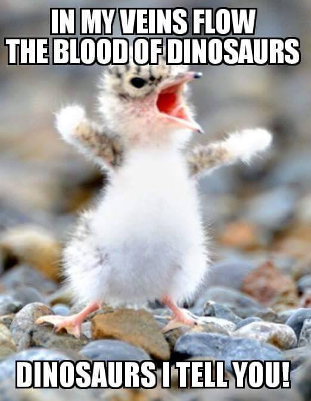
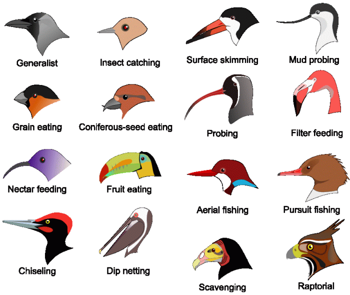
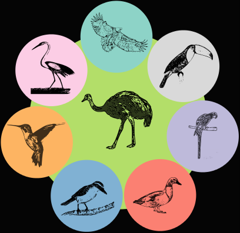
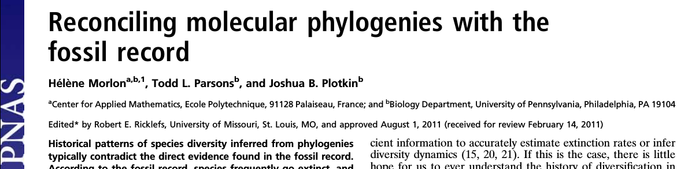
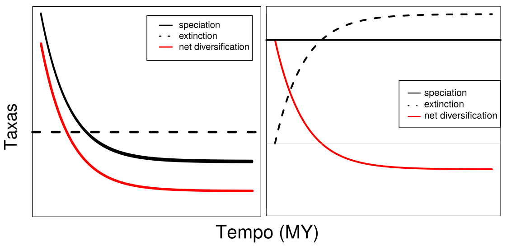
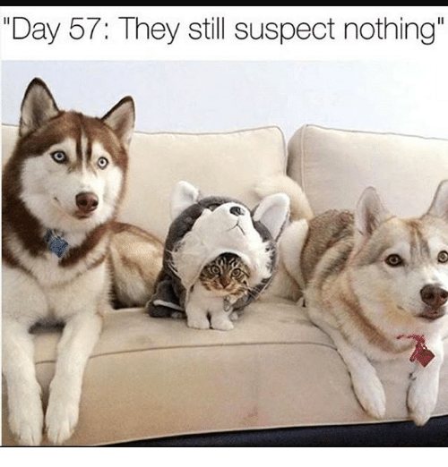

# {data-background="img/title_background.png" data-background-size=100%}

<h2>Os papéis da dieta, especiação e extinção na diversificação de aves e na montagem de redes de frugivoria</h2>

<br></br>

<div align="right">
<p>Gustavo Burin **FERREIRA**</p>
<p>Orientador: Tiago Bosisio **QUENTAL**</p>
<p>Co-orientador: Paulo R. **GUIMARÃES** Jr</p>

<br></br>
</div>

20 de Março de 2018

# Estrutura {.center}

- Capítulo 1: Dieta + Diversificação
- Capítulo 2: Performance de Métodos
- Capítulo 3: Diversificação + Redes
- Trajetória pessoal

# {data-notes="Estima-se que 99% de todas as espécies que já passaram pelo planeta foram extintas." data-background="img/diversity_color.png" data-background-size=100%}

# Macroevolução {.center}

# {data-notes="Essas escalas de tempo são difíceis de imaginar. Como podemos estudar isso então? Precisamos de uma máquina do tempo" data-background="img/time_machine.png"}

# {data-notes="Existem basicamente dois tipos de dados que podemos usar como máquinas do tempo. Uma das formas é através do registro fóssil" data-background="img/canid_fossil.jpg"}

# {data-notes="Para os grupos dos quais não dispomos de dados fósseis, a forma que temos de viajar no tempo é usando filogenias moleculares." data-background="img/tree_bamm.png" data-background-size=60%}

# Por que aves? {data-notes="Uma das razões é que é muito legal poder falar que vc trabalha com os únicos dinossauros vivos" .center}



# {data-notes="Ocupam todos os continentes. O sucesso do grupo é bastante interessante, especialmente do ponto de vista da macroevolução." data-background="img/kissling_et_al_2012.png" data-background-size=100%}

# {data-notes="Infelizmente aves não possuem um registro fóssil muito rico, devido a características como os ossos pneumáticos que resistem menos aos processos de fossilização" data-background="img/archaeopteryx.jpg" data-background-size=50%}

# {data-notes="No entanto, é um grupo para o qual dados moleculares são abundantes e permitiram estabelecer razoavelmente bem suas relações de parentesco. As aves se originaram a cerca de 120MY." data-background="img/jetz2012.png" data-background-size=70%}

# {data-notes="Sendo assim não é de se estranhar que sejam um grupo extremamente rico em morfologias" data-background="img/Bird_Diversity2.png" data-background-size=90%}

# {data-notes="Essas diferentes morfologias podem representar diferentes ecologias, como por exemplo os bicos que são mais adaptados a diferentes dietas"}

```{r echo = FALSE}

```

# {data-notes="As diferenças nas ecologias também se refletem nas diferentes interações ecológicas aves desempenham, como dispersão de sementes, predação, consumo de carcaças, e polinização." data-background="img/bird_services.png" data-background-size=77%}

# Objetivos {#items .center .emphasized}

> - Entender os efeitos de diferentes dietas na diversificação do grupo
> - Testar a performance de métodos amplamente utilizados
> - Analisar a relação entre a diversificação e o papel ecológico

# Capítulo 1 {data-background="img/natcomms.png" data-background-size=75%}

# {data-notes="Price et al. 2012 analisaram o efeito da dieta na diversificação de mamíferos, e encontraram resultados interessantes. Ficamos curiosos sobre o quão amplo é esse padrão, então testamos em aves. " data-background="img/price_results.png" data-background-size=70%}

# {data-notes="Resultados para net diversification" data-background="img/cap1fig1_black.png" data-background-size=90%}

# {data-notes="Como então que a riqueza tão alta - 1150 espécies - pode ser mantida se em teoria essa guilda está em declínio?" data-background="img/omniv_phylo.png" data-background-size=60% .center}

<h1 class="fragment" style="background:rgba(0,0,0,0.5);">1150 espécies de onívoros</h1>

# {data-notes="O que mantém a diversidade são as transições preferenciais para onivoria" data-background="img/transitions_white.png" data-background-size=60%}

# Resumo - Resultados {data-notes="Mensagens para levar pra casa"}
<br></br>

> - *Net diversification* menor em onívoros
> - Menor especiação e/ou maior extinção
> - Transições preferenciais para onivoria

# {data-notes="Recursos abundantes e/ou previsíveis" .center}

<h2>Recursos abundantes/previsíveis</h2>



# {data-notes="Recursos abundantes e/ou previsíveis" .center}

<h2>Recursos abundantes/previsíveis</h2>


# {data-notes="Recursos escassos/imprevisíveis" .center}

<h2>Recursos escassos/imprevisíveis</h2>


# {data-notes="Recursos escassos/imprevisíveis" .center}

<h2>Recursos escassos/imprevisíveis</h2>


# Capítulo 2 {.center}

<p style="font-size:2em;color:white;">How well can we estimate diversity dynamics for clades in diversity decline?</p>

<br></br>

Gustavo **BURIN**; Laura **ALENCAR**; Jonathan **CHANG**; Michael **ALFARO**; Tiago **QUENTAL**

<br></br>

<p style="font-size:0.7em;"> Em revisão (aceito com <i>major</i>) na <b><i>Systematic Biology</i></b></p>

# {data-notes="Recentemente dois métodos foram desenvolvidos e são amplamente utilizados. RPANDA: seleção de modelos; BAMM: rjMCMC. Em ambos em teoria seria capaz de detectarmos declínio de diversidade" .center}

```{r echo = FALSE, out.width = 1400}

```

```{r echo = FALSE, out.width = 1400}
knitr::include_graphics('./img/bamm.png')
```

# {data-notes="O objetivo desse capítulo é avaliar a capacidade desses dois métodos de detectar declínio de diversidade a partir de filogenias em cenários onde especiação ou extinção variam, usando simulações e árvores empíricas. Além disso avaliar intensidade do declínio." data-background="img/diversity_timetravel.png" data-background-size=50%}

# {data-notes="O desenho geral do experimento é esse" data-background="img/workflow.png" data-background-size=80%}



# {data-notes="No primeiro cenário (SPVAR), ambas as taxas são bem estimadas no presente, e o modelo real (verde nesse caso) também é selecionado" data-background="img/spvar_lambda_full.png" data-background-size=52% .center}

# {data-notes="No primeiro cenário (SPVAR), ambas as taxas são bem estimadas no presente, e o modelo real (verde nesse caso) também é selecionado" data-background="img/spvar_mu_full.png" data-background-size=52% .center}

# {data-notes="Os valores na raiz são ruins tanto para o RPANDA, e a especiação inicial é superestimada, indicando que os modelos estão atribuindo a variação na diversificação à especiação" data-background="img/bcdv_rpanda_panel.png" data-background-size=42%}

# {data-notes="No caso das empíricas, não sabemos o modelo correto, mas os modelos não concordam nas estimativas, em especial na base das árvores" data-background="img/cap2_empirical.png" data-background-size=60% .center}

# Mensagens {.center}

> - Primeiro teste mais abrangente (espaço de parâmetros e *time-travel*)
> - Ambos os modelos estimam as taxas bem no presente
> - Atribui variação na diversificação à especiação (força queda)

# Implicações práticas {.center}

> - Dificuldade em detectar variação na extinção
> - Estimativas ruins na raiz: reconstrução da história é falha
> - Discordam nas empíricas
> - Queda na especiação não parece ser tão comum


# Capítulo 3 {.center}

<br></br>

<p style="font-size:2em;color:white;">The role of diversification rates on the assembly of frugivory networks</p>

<br></br>

Gustavo **BURIN**; Paulo **GUIMARÃES**; Tiago **QUENTAL**

# {data-notes="Na introdução falamos sobre as interações que as aves fazem parte. Falamos também que são um dos principais grupos de dispersores" data-background="img/bird_services.png" data-background-size=77%}

# {data-notes="As aves são o principal grupo que atua na dispersão de sementes" data-background="img/donatti_et_al.png" data-background-size=80%}

# {data-notes="Mas as espécies centrais tem uma história evolutiva similar? No terceiro capítulo testamos a relação entre taxas de diversificação e o papel ecológico desempenhado pelas espécies de aves em redes de frugivoria" data-background="img/cap3fig1.png" data-background-size=80% .center}

<h1 class="fragment" style="background:rgba(0,0,0,0.75);">Espécies mais centrais pertencem a linhagens mais estáveis/confiáveis</h1>

# {data-notes="Essas redes estão distribuídas em diferentes biomas" data-background="img/cap3fig2.png" data-background-size=75%}

# {data-notes="Além disso, as 546 espécies únicas estão relativamente bem distribuídas ao longo da filogenia" data-background="img/phylonet.png" data-background-size=70%}

# {data-notes="Utilizamos também as taxas de diversificação estimadas usando o BAMM" data-background="img/cap3fig4.png" data-background-size=90%}

<h2><div style="float: left; width=50%;">Especiação</div> <div style="float: right; width=50%;">Extinção</div></h2>

# {data-notes="Dentre todas as relações analisadas (clos/betw + epsilon + clima) encontramos uma relação negativa entre epsilon e closeness centrality e sua interação com precipitação anual" data-background="img/cap3fig11.png" data-background-size=90% .center}

<h3 class="fragment" style="background:rgba(0,0,0,0.75);">Closeness ~ Epsilon * Prec.An./Saz.Prec.</h3>

# {data-notes="Dentre todas as relações analisadas (clos/betw + epsilon + clima) encontramos uma relação negativa entre epsilon e closeness centrality e sua interação com precipitação anual" data-background="img/cap3fig11.png" data-background-size=90% .center}

<h2 style="background:rgba(0,0,0,0.75);">Espécies de linhagens menos estáveis não são centrais em regiões temperadas</h2>

<h2 style="background:rgba(0,0,0,0.75);">Interação positiva com precipitação total e negativa com sazonalidade de precipitação</h2>

# Resultados {data-notes="Tradeoff: redes quantitativas mostraram mais relações do que redes binárias" .center}

> - Relação negativa: espécies menos estáveis/"confiáveis" não são centrais em redes temperadas (*species sorting*)
> - Relação modulada por disponibilidade hídrica (total e sazonal)
> - Pool global vs. pool local
> - Redes quantitativas vs. redes binárias

# {.center}
<h2>Mensagens finais - cap 1</h2>

> - Onívoros parecem ser um ralo macroevolutivo
> - Diversidade de onívoros mantida por transições
> - Diversidade regulada por mosaico espaço-temporal de seleção

# {.center}
<h2>Mensagens finais - cap 2</h2>

> - Métodos filogenéticos estimam bem no presente
> - Falha em detectar variação na extinção: reconstrução errada
> - Questiona prevalência de queda na especiação

# {.center}

<h2>Mensagens finais - cap 3</h2>

> - Espécies de linhagens menos estáveis não são centrais em regiões temperadas
> - Montagem influenciada pela disponibilidade de água (fenologia)
> - Trópicos: compensação de intimidade por quantidade

# Minha trajetória

# {data-notes="Na iniciação e no mestrado eu trabalhei com dendrocronologia. Ao fim do mestrado, minha relação com meu orientador estava desgastada, e decidi que não queria continuar lá. O que fazer então?" data-background="img/dendro.png" data-background-size=50%}

# {data-notes="Sempre achei que queria ficar na academia, então fui testar o mercado de trabalho para ter certeza de que academia era o meu lugar mesmo. E era."}

- NATURA?
  
# {data-notes="Comecei a procurar onde poderia me encaixar na eco, já que tinha feito muitas disciplinas aqui. Daí entrei em contato com o Tiago e a compatibilidade ficou evidente" data-background="memerry.jpg"}

- MeMerry Christmas (2016/2017)

# 1º ano {data-notes="O primeiro ano foi um misto de empolgação e bastante tensão. Me sentia bastante perdido em vários momentos, contei bastante com a ajuda dos meus colegas de lab e do Tiago."}



# 2º ano {data-notes="No segundo ano já estava mais ambientado, mas ao mesmo tempo começava a me dar conta ao mesmo tempo do potencial do meu trabalho e do quanto a minha ansiedade me prejudicava. Já era a terceira vez que pedia bolsa da fapesp que era negada, e isso só contribuía pra aumentar essa ansiedade. Também fui RD na CCP, e pude entender melhor como um programa de pós funciona, além de ter a possibilidade de ajudar aluno(a)s com dificuldades."}


     
# 3º ano {data-notes="No início do 3o ano, comecei a fazer terapia pra tentar arrumar um pouco da bagunça na minha cabeça. Foi ótimo para ficar claro que os problemas não eram só causados pela tensão da pós graduação. No fim de 2015 (metade do 3o ano) eu pesava 201kg, e resolvi que a melhor coisa a fazer seria a cirurgia bariátrica."}

- Fotos pré-cirurgia
  
# 4º ano {data-notes="Eu comecei meu último ano de doutorado entrando na faca, e foi uma das melhores decisões da minha vida. Perdi 83kg desde então, e descobri um novo hobby: a corrida. Não conseguia andar 3 quarteirões sem parar para descansar, e agora estou me preparando para correr 10k."}

#

> - Não tenha medo de mudar. O novo assusta, mas também empolga.
> - Os problemas vão surgir (ansiedade, depressão, estresse), estejam preparados e abertos.
> - Sua saúde (física e mental) e sua vida fora da academia importam tanto quanto seu esforço no laboratório.

# Agradecimentos

  - Depto. de Ecologia
  - CAPES
  - FAPESP
  - LabMeMe
  - Tássia

# Obrigado! {.center}