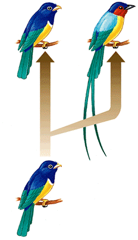
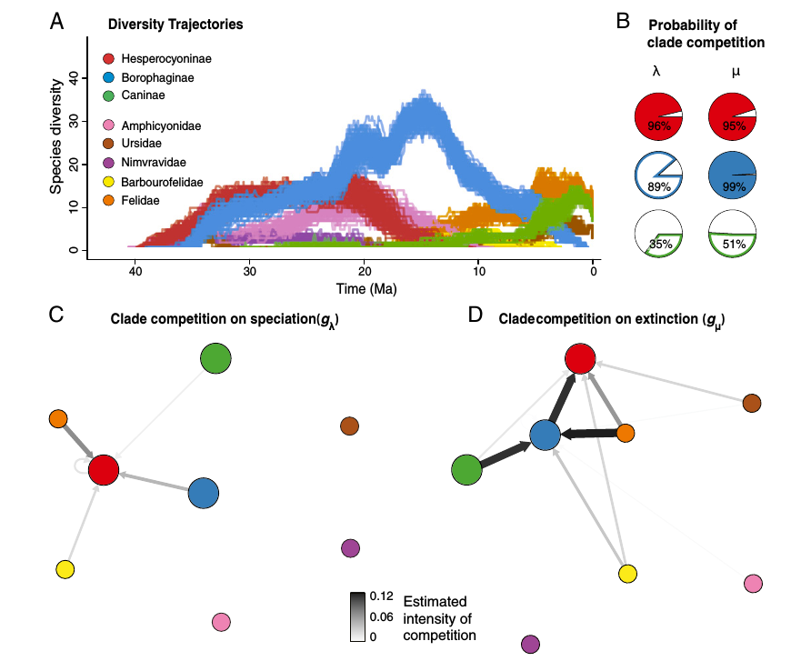
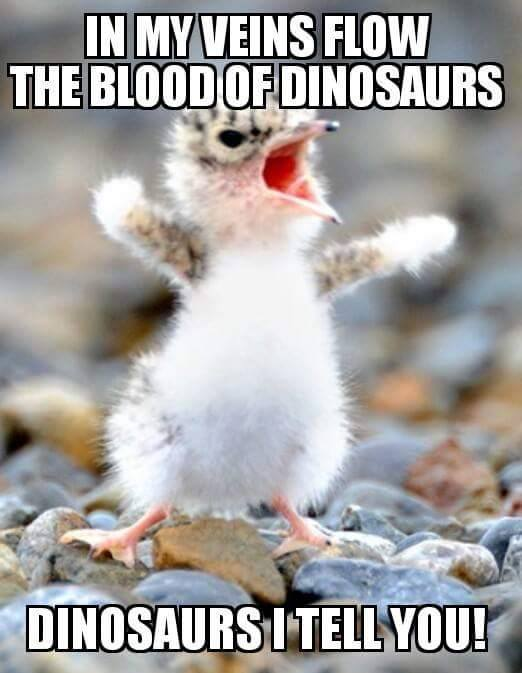
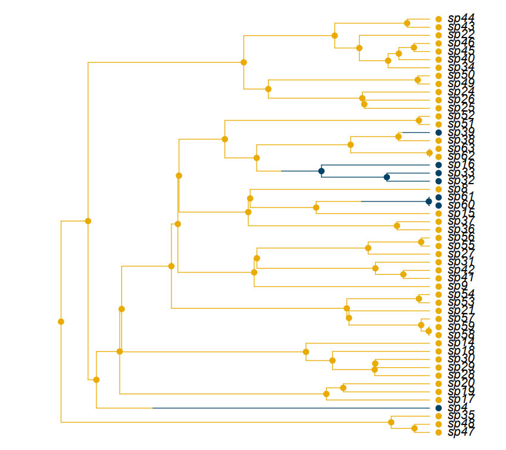
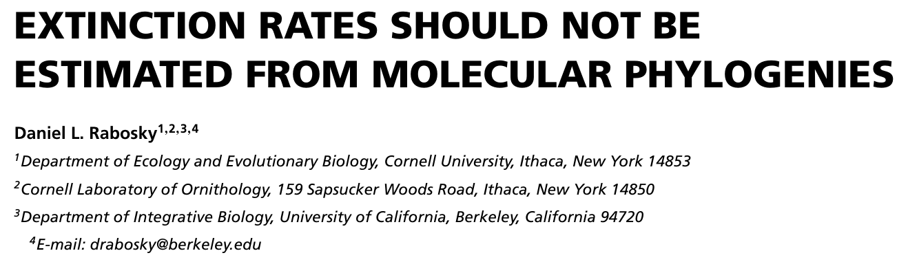
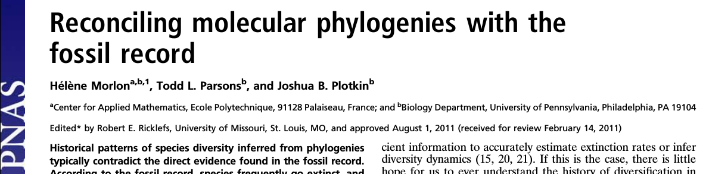
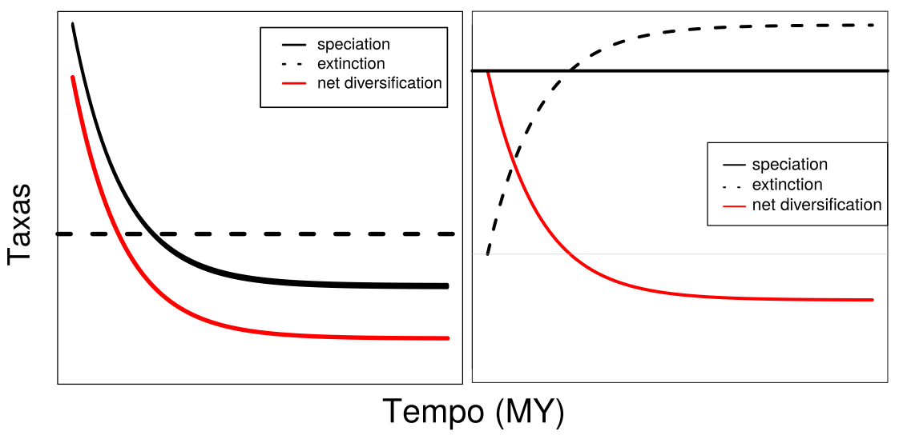

# {data-background="img/title_background.png" data-background-size=100%}

<h2>Os papéis da dieta, especiação e extinção na diversificação de aves e na montagem de redes de frugivoria</h2>

<br></br>

<div align="right">
<p>Gustavo Burin **FERREIRA**</p>
<p>Orientador: Tiago Bosisio **QUENTAL**</p>
<p>Co-orientador: Paulo R. **GUIMARÃES** Jr</p>

<br></br>
</div>

02 de Outubro de 2017

# Estrutura {.center}

- Introdução
- Capítulo 1: Dieta + Diversificação
- Capítulo 2: Performance de Métodos
- Capítulo 3: Diversificação + Redes
- Conclusões

# {data-notes="Estima-se que 99% de todas as espécies que já passaram pelo planeta foram extintas." data-background="img/diversity_color.png" data-background-size=100%}

# {data-notes="Além disso, até chegar na diversidade atual, o planeta passou por fases de aumento e diminuição do número de espécies, como por exemplo as conhecidas 5 (ou 6) extinções em massa. Essas variações em larga escala (espacial, temporal e biológica) é o que a macroevolução busca estudar." data-background="img/mass_extinctions.jpg" data-background-size=90%}

# Macroevolução {.center}

# {data-notes="O que procuramos entender é como acontece e o que afeta a formação e o desaparecimento de novas espécies, em escalas de tempo bastante amplas. Macroevolução é a área que estuda a evolução acima do nível da espécie." data-background="img/deeptime_evolution.png" data-background-size=60%}

# Especiação {data-notes="Especiação é o processo de surgimento de novas espécies, quando há isolamento reprodutivo"}

```{r echo = FALSE, out.width = 300}

```

# Extinção {data-notes="Extinção por outro lado é o processo de desaparecimento de uma espécie/linhagem, quando a última população desaparece seja por eventos catastróficos como no caso dos dinossauros, seja por outros motivos" .center}

```{r echo = FALSE, out.width = 600}

```

# {data-notes="O balanço entre esses dois processos durante milhões de anos, modulados por diferentes mecanismos como por exemplo eventos geológicos, que determina a diversidade em um momento no tempo." data-background-video="img/marine_fossil_history.mp4" data-background-size=75%}

# {data-notes="Essas escalas de tempo são difíceis de imaginar. Como podemos estudar isso então? Precisamos de uma máquina do tempo" data-background="img/time_machine.png"}

# {data-notes="Existem basicamente dois tipos de dados que podemos usar como máquinas do tempo. Uma das formas é através do registro fóssil" data-background="img/canid_fossil.jpg"}

# {data-notes="Nesse exemplo, os autores mostraram que gatos são melhores que cachorros. Foi possível analisar a dinâmica da diversificação das 3 subfamílias de canidae, e também sugerir as causas do declínio das 2 subfamílias extintas" data-background="img/canid_fossil.jpg" .center}

```{r echo = FALSE, out.width = 800}

```

# {data-notes="No entanto, apesar de ao pensarmos em evolução geralmente associarmos a fósseis, eles representam um dos extremos de um espectro de disponibilidade de dados. No outro lado do espectro estão grupos com registro fóssil ruim e apenas espécies vivas." data-background="img/data_types.png" data-background-size=60%}

# {data-notes="Para os grupos dos quais não dispomos de dados fósseis, a forma que temos de viajar no tempo é usando filogenias moleculares." data-background="img/tree_bamm.png" data-background-size=60%}

# {data-notes="Mas o que são as filogenias moleculares? Com o advento da biologia molecular, cada dia mais está mais fácil sequenciar genes." data-background="img/alignment.png" data-background-size=90%}

# {data-notes="Usamos esses dados de sequências de DNA e aplicamos modelos de evolução molecular para estimar quanto tempo levou para duas sequências (ou duas espécies) se separarem no tempo" data-background="img/molclock.jpg" data-background-size=80%}

# {data-notes="Com isso, foi por exemplo possível construir a árvore da vida, que estabelece não só relações de parentesco, mas também estimativas de tempo de divergência" data-background="img/treeoflife.jpg" data-background-size=50%}

# {data-notes="Diferentemente da Laura por exemplo, não tenho um grupo preferido. Por que escolhi aves então?" data-background="img/alencar_et_al_2016.png" data-background-size=80%}

# Por que aves? {data-notes="Uma das razões é que é muito legal poder falar que vc trabalha com os únicos dinossauros vivos" .center}



# {data-notes="Brincadeiras (ou não) a parte, é um grupo com uma quantidade imensa de dados, que vão desde registros históricos de avistamentos" data-background="img/historical_data.png" data-background-size=50%}

# {data-notes="Até scans 3d de quase 3k espécies" data-background="img/markmybird.png" data-background-size=100% .center}

# {data-notes="A imensa quantidade de dados permite com que a ecologia desse grupo seja intensamente estudada." data-background="img/migrating_birds.gif" data-background-size=60%}

# {data-notes="Ocupam todos os continentes. O sucesso do grupo é bastante interessante, especialmente do ponto de vista da macroevolução." data-background="img/kissling_et_al_2012.png" data-background-size=100%}

# {data-notes="Infelizmente aves não possuem um registro fóssil muito rico, devido a características como os ossos pneumáticos que resistem menos aos processos de fossilização" data-background="img/archaeopteryx.jpg" data-background-size=50%}

# {data-notes="No entanto, é um grupo para o qual dados moleculares são abundantes e permitiram estabelecer razoavelmente bem suas relações de parentesco. As aves se originaram a cerca de 120MY." data-background="img/jetz2012.png" data-background-size=70%}

# {data-notes="Sendo assim não é de se estranhar que sejam um grupo extremamente rico em morfologias" data-background="img/Bird_Diversity2.png" data-background-size=90%}

# {data-notes="Essas diferentes morfologias podem representar diferentes ecologias, como por exemplo os bicos que são mais adaptados a diferentes dietas"}

```{r echo = FALSE}
knitr::include_graphics('./img/BirdBeaks.gif')
```

# {data-notes="As diferenças nas ecologias também se refletem nas diferentes interações ecológicas aves desempenham, como dispersão de sementes, predação, consumo de carcaças, e polinização." data-background="img/bird_services.png" data-background-size=77%}

# SEED DISPERSAL {data-notes="Grupo mais importante pra dispersão de sementes, interagindo com muitas espécies de plantas ao mesmo tempo, formando redes de interação. Mas essas redes são formadas ao acaso ou existe um padrão evolutivo por trás?"}

# Objetivos {#items .center .emphasized}

> - Entender os efeitos de diferentes dietas na diversificação do grupo
> - Testar a performance de métodos amplamente utilizados
> - Analisar a relação entre a diversificação e o papel ecológico

# Capítulo 1 {.center}

```{r echo = FALSE}
knitr::include_graphics('./img/natcomms.png')
```

# {data-notes="Price et al. 2012 analisaram o efeito da dieta na diversificação de mamíferos, e encontraram resultados interessantes. Ficamos curiosos sobre o quão amplo é esse padrão, então testamos em aves. " data-background="img/price_results.png" data-background-size=70%}

# {data-notes="É um grupo bastante rico em espécies com suas relações de parentesco razoavelmente bem conhecidas" data-background="img/jetz2012.png" data-background-size=70%}

# {data-notes="Cientistas compilam dados também" data-background="img/kissling_data.png" data-background-size=80%}

# {data-notes="R+diversitree. Taxas de especiação, extinção e transição pra cada estado. Transições são mudanças anagenéticas, ou seja, sem especiação" data-background="img/r_diversitree.png" data-background-size=70%}

<h2>Como?</h2>



# Como? {data-notes="Estimamos as taxas pra cada guilda de dieta"}

- Incorporar incerteza filogenética (200 árvores)
- Especiação, extinção e transições para 9 dietas (93 parâmetros)
- Abordagem Bayesiana: 1500000 iterações
- 2 meses de processamento

```{r echo = FALSE, out.width = 300}

```

# {data-notes="Resultados para net diversification" data-background="img/cap1fig1_black.png" data-background-size=90%}

# {data-notes="Menor especiação e/ou maior extinção que as demais guildas." data-background="img/cap1fig2_black.png" data-background-size=90%}

# {data-notes="Menor especiação e/ou maior extinção que as demais guildas." data-background="img/cap1fig2_black_highlight.png" data-background-size=90% data-transition="none"}

# {data-notes="Além da netdiv ser menor, ela é inclusive negativa" data-background="img/cap1fig1_black.png" data-background-size=90%}

# {data-notes="Como então que a riqueza tão alta - 1150 espécies - pode ser mantida se em teoria essa guilda está em declínio?" data-background="img/omniv_phylo.png" data-background-size=60% .center}

<h1 class="fragment" style="background:rgba(0,0,0,0.5);">1150 espécies de onívoros</h1>

# {data-notes="O que mantém a diversidade são as transições preferenciais para onivoria" data-background="img/transitions_white.png" data-background-size=60%}

# Resumo - Resultados {data-notes="Mensagens para levar pra casa"}
<br></br>

> - *Net diversification* menor em onívoros
> - Menor especiação e/ou maior extinção
> - Transições preferenciais para onivoria

# {data-notes="Recursos abundantes e/ou previsíveis" .center}

<h2>Recursos abundantes/previsíveis</h2>


# {data-notes="Recursos abundantes e/ou previsíveis" .center}

<h2>Recursos abundantes/previsíveis</h2>


# {data-notes="Recursos escassos/imprevisíveis" .center}

<h2>Recursos escassos/imprevisíveis</h2>


# {data-notes="Recursos escassos/imprevisíveis" .center}

<h2>Recursos escassos/imprevisíveis</h2>


# Capítulo 2 {.center}

<p style="font-size:2em;color:white;">How well can we estimate diversity dynamics for clades in diversity decline?</p>

<br></br>

Gustavo **BURIN**; Laura **ALENCAR**; Jonathan **CHANG**; Michael **ALFARO**; Tiago **QUENTAL**

<br></br>

<p style="font-size:0.7em;"> Segunda revisão na revista <b><i>Systematic Biology</i></b></p>

# {data-notes="Como vimos no capítulo anterior, é possível usar molphylo para estimar lambda/mu" data-background="img/tree_bamm.png" data-background-size=60%}

# {data-notes="Porém nem tudo são flores. Existe um debate rolando sobre até que ponto podemos estimar as taxas de extinção em molphylo."}




# {data-notes="Isso porque filogenias moleculares não possuem informação direta sobre extinção." data-background="img/phylo_ltt.png" data-background-size=60%}

# {data-notes="Olhando para toda a diversidade que existe e já existiu, sabemos que extinção é um fator extremamente importante." data-background="img/diversity_color.png" data-background-size=100%}

# {data-notes="Podemos então esperar que os grupos viventes podem estar em expansão, saturação ou declínio, no entanto o último caso imagina-se ser comum e é pouco estudado, e um dos motivos são limitações metodológicas" data-background="img/growth_scenarios.png" data-background-size=100%}

# {data-notes="Recentemente dois métodos foram desenvolvidos e são amplamente utilizados. RPANDA: seleção de modelos; BAMM: rjMCMC. Em ambos em teoria seria capaz de detectarmos declínio de diversidade" .center}

```{r echo = FALSE, out.width = 1400}

```

```{r echo = FALSE, out.width = 1400}
knitr::include_graphics('./img/bamm.png')
```

# {data-notes="O objetivo desse capítulo é avaliar a capacidade desses dois métodos de detectar declínio de diversidade a partir de filogenias em cenários onde especiação ou extinção variam, usando simulações e árvores empíricas. Além disso avaliar intensidade do declínio." data-background="img/diversity_timetravel.png" data-background-size=50%}

# {data-notes="O desenho geral do experimento é esse" data-background="img/workflow.png" data-background-size=80%}

# {data-notes="O desenho geral do experimento é esse" data-background="img/workflow.png" data-background-size=80% .center}



# {data-notes="Um passo importante é o processo de pruning, onde removemos as espécies extintas para termos as filogenias moleculares" data-background="img/workflow.png" data-background-size=80% .center}

# {data-notes="Um passo importante é o processo de pruning, onde removemos as espécies extintas para termos as filogenias moleculares" data-background="img/simtree_full.png" data-background-size=60% .center}

# {data-notes="Um passo importante é o processo de pruning, onde removemos as espécies extintas para termos as filogenias moleculares" data-background="img/simtree_mol.png" data-background-size=60% .center}

# {data-notes="Na última etapa, utilizamos os dois métodos para estimar as taxas. Como o RPANDA usa seleção de modelos, testamos esses 4 cenários de variação nas taxas" data-background="img/workflow.png" data-background-size=80% .center}


# {data-notes="O espaço de parâmetros foi explorado dessa forma, muito mais abrangente que o estudo da Helene (pontos pretos)" data-background="img/parspace.png" data-background-size=80%}

# {data-notes="Interessante é que fomos capazes de gerar árvores de tamanhos bastante similares, mas com assinaturas bastante diferentes" data-background="img/tree_features.png" data-background-size=80% .center}

# {data-notes="No primeiro cenário (SPVAR), ambas as taxas são bem estimadas no presente, e o modelo real (verde nesse caso) também é selecionado" data-background="img/spvar_lambda_full.png" data-background-size=52% .center}

# {data-notes="No primeiro cenário (SPVAR), ambas as taxas são bem estimadas no presente, e o modelo real (verde nesse caso) também é selecionado" data-background="img/spvar_mu_full.png" data-background-size=52% .center}

# {data-notes="No segundo cenário (EXVAR), ambas as taxas são bem estimadas no presente, porém o modelo real (amarelo nesse caso) não é selecionado" data-background="img/exvar_lambda_full.png" data-background-size=52% .center}

# {data-notes="No segundo cenário (EXVAR), ambas as taxas são bem estimadas no presente, porém o modelo real (amarelo nesse caso) não é selecionado" data-background="img/exvar_mu_full.png" data-background-size=52% .center}

# {data-notes="Os valores na raiz são ruins tanto para o BAMM" data-background="img/bcdv_bamm_panel.png" data-background-size=42%}

# {data-notes="Os valores na raiz são ruins tanto para o RPANDA" data-background="img/bcdv_rpanda_panel.png" data-background-size=42%}

# Árvores empíricas {.center}

> - 214 filogenias
> - 5 grandes grupos de vertebrados
> - Representam cenários mais complexos
> - Um modelo a mais: BOTHexp

# {data-notes="No caso das empíricas, não sabemos o modelo correto, mas os modelos não concordam nas estimativas, em especial na base das árvores" data-background="img/cap2_empirical.png" data-background-size=60% .center}

# Mensagens {.center}

> - Expandimos o espaço de parâmetros estudado
> - Ambos os modelos estimam as taxas bem no presente
> - Momento do declínio tem pouca influência

# Implicações práticas {.center}

> - Dificuldade em detectar variação na extinção
> - Estimativas ruins na raiz: reconstrução da história é falha
> - Discordam nas empíricas
> - Queda na especiação não parece ser tão comum
> - $\gamma$ pode auxiliar


# Capítulo 3 {.center}

<br></br>

<p style="font-size:2em;color:white;">The role of diversification rates on the assembly of frugivory networks</p>

<br></br>

Gustavo **BURIN**; Paulo **GUIMARÃES**; Tiago **QUENTAL**

# {data-notes="Na introdução falamos sobre as interações que as aves fazem parte. Falamos também que são um dos principais grupos de dispersores" data-background="img/bird_services.png" data-background-size=77%}

# {data-notes="As aves são o principal grupo que atua na dispersão de sementes" data-background="img/donatti_et_al.png" data-background-size=80%}

# {data-notes="Para representar o papel dessas espécies em uma rede, usamos diferentes métricas. Nesse exemplo de uma rede de relacionamentos, vemos que dependendo da métrica o nó mais central muda" data-background="img/network_metrics.png" data-background-size=50%}

# {data-notes="Mas as espécies centrais tem uma história evolutiva similar? No terceiro capítulo testamos a relação entre taxas de diversificação e o papel ecológico desempenhado pelas espécies de aves em redes de frugivoria" data-background="img/cap3fig1.png" data-background-size=80% .center}

<h1 class="fragment" style="background:rgba(0,0,0,0.75);">Espécies mais centrais pertencem a linhagens mais estáveis/confiáveis</h1>

# {data-notes="Usamos os dados de 34 redes de frugivoria (23 quantitativas e 11 binárias" data-background="img/bipartite.jpg" data-background-size=80% .center}

# {data-notes="Essas redes estão distribuídas em diferentes biomas" data-background="img/cap3fig2.png" data-background-size=75%}

# {data-notes="Além disso, as 546 espécies únicas estão relativamente bem distribuídas ao longo da filogenia" data-background="img/phylonet.png" data-background-size=70%}

# {data-notes="Utilizamos também as taxas de diversificação estimadas usando o BAMM" data-background="img/cap3fig4.png" data-background-size=90%}

<h2><div style="float: left; width=50%;">Especiação</div> <div style="float: right; width=50%;">Extinção</div></h2>

# Testes {.center}

> - Epsilon (extinção/especiação)
> - "Pura" e z-score (pool global vs. pool local)
> - 6 co-fatores: Prec. Anual, Saz. Prec., Temp. Média Anual, Saz. Temp., Mod., Aninh.
> - PGLS

# {data-notes="Dentre todas as relações analisadas (clos/betw + epsilon + clima) encontramos uma relação negativa entre epsilon e closeness centrality e sua interação com precipitação anual" data-background="img/cap3fig11.png" data-background-size=90% .center}

<h3 class="fragment" style="background:rgba(0,0,0,0.75);">Closeness ~ Epsilon * Prec.An./Saz.Prec.</h3>

# {data-notes="Dentre todas as relações analisadas (clos/betw + epsilon + clima) encontramos uma relação negativa entre epsilon e closeness centrality e sua interação com precipitação anual" data-background="img/cap3fig11.png" data-background-size=90% .center}

<h2 style="background:rgba(0,0,0,0.75);">Espécies mais menos estáveis não são centrais</h2>

<h2 style="background:rgba(0,0,0,0.75);">Interação positiva com precipitação total e negativa com sazonalidade de precipitação</h2>

# Resultados {data-notes="Tradeoff: redes quantitativas mostraram mais relações do que redes binárias" .center}

> - Relação negativa: espécies menos estáveis/"confiáveis" não são centrais (*species sorting*)
> - Relação modulada por disponibilidade hídrica (total e sazonal)
> - Pool global vs. pool local
> - Redes quantitativas vs. redes binárias

# Discussão {data-notes="Pool global: pace absoluto importa; Trópicos: maior riqueza pode suprir intimidade" .center}

> - Disponibilidade hídrica: fenologia
> - *Species sorting*: filtro global ("tempo absoluto")
> - Trópicos: *Tradeoff* entre número de interações e número de espécies (maior riqueza)

# FENOLOGIA {data-notes="Disponibilidade de água pode estar relacionado com a fenologia. Diferentes espécies tem relações diferentes com o clima, mas essa relação é geralmente mantida ano após ano."}

# {.center}
<h2>Mensagens finais - cap 1</h2>

> - Onívoros parecem ser um ralo macroevolutivo
> - Diversidade de onívoros mantida por transições
> - Diversidade regulada por mosaico espaço-temporal de seleção

# {.center}
<h2>Mensagens finais - cap 2</h2>

> - BAMM e RPANDA estimam bem no presente
> - Variação na extinção: reconstrução errada
> - Cenários complexos: métodos discordam

# {.center}

<h2>Mensagens finais - cap 3</h2>

> - Espécies centrais vem de linhagens mais estáveis em regiões temperadas
> - Montagem influenciada pela disponibilidade de água (fenologia)
> - Trópicos: compensação de intimidade por quantidade

# Obrigado! {.center}