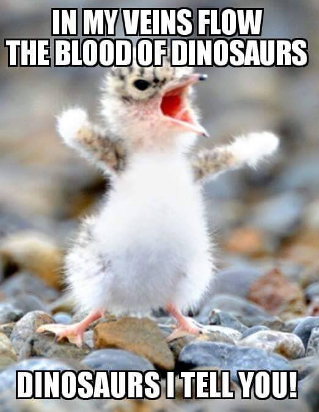
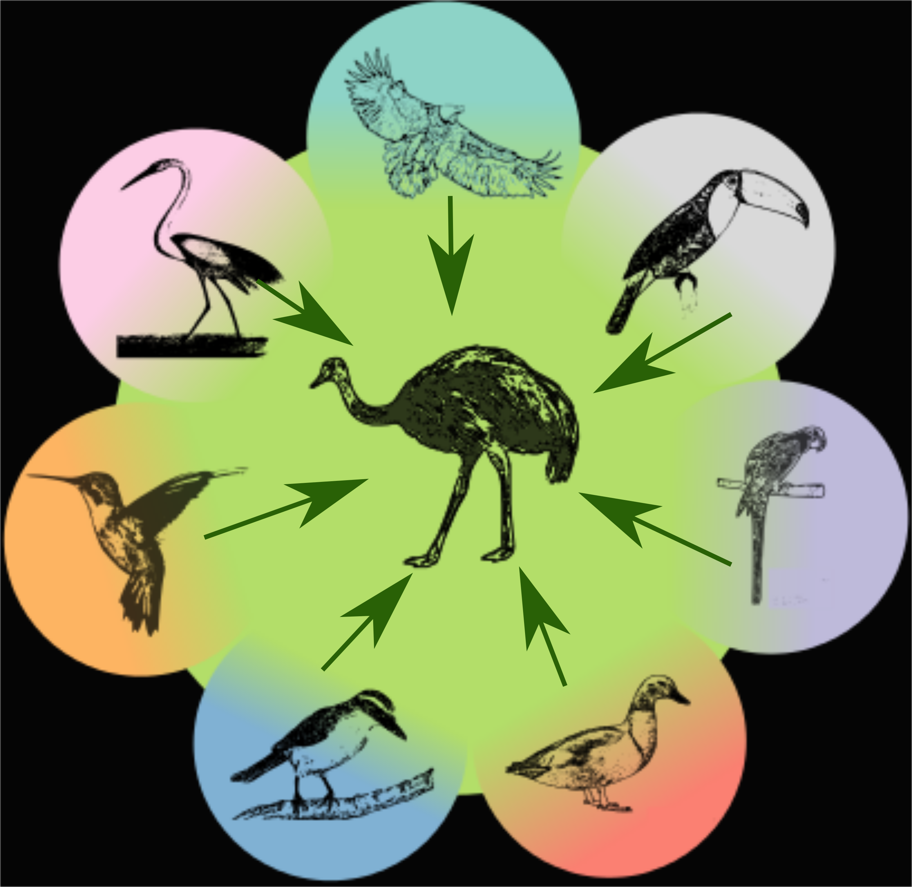

# {data-background="img/title_background.png" data-background-size=100%}

<h2>Os papéis da dieta, especiação e extinção na diversificação de aves e na montagem de redes de frugivoria</h2>

<br></br>

<div align="right">
<p>Gustavo Burin **FERREIRA**</p>
<p>Orientador: Tiago Bosisio **QUENTAL**</p>
<p>Co-orientador: Paulo R. **GUIMARÃES** Jr</p>

<br></br>
</div>

20 de Março de 2018

# {data-background="img/agradecimentos.png" data-background-size=70%}

# Estrutura {data-notes="Estima-se que 99% de todas as espécies que já passaram pelo planeta foram extintas." .center}

- Capítulo 1: Dieta + Diversificação
- Capítulo 2: Performance de Métodos
- Capítulo 3: Diversificação + Redes
- Trajetória pessoal

# {data-background="img/diversity_color.png" data-background-size=100%}

# Macroevolução {data-notes="Essas escalas de tempo são difíceis de imaginar. Como podemos estudar isso então? Precisamos de uma máquina do tempo" .center}

# {data-notes="Um dos tipos de máquina do tempo é o registro fóssil." data-background="img/time_machine.png"}

# {data-notes="Para os grupos dos quais não dispomos de dados fósseis, a forma que temos de viajar no tempo é usando filogenias moleculares." data-background="img/archaeopteryx.jpg" data-background-size=50%}

# {data-notes="Um grupo que se encaixa nesse cenário são as Aves. Uma das razões é que é muito legal poder falar que vc trabalha com os únicos dinossauros vivos" data-background="img/tree_bamm.png" data-background-size=60%}

# Por que aves? {data-notes="Ocupam todos os continentes. O sucesso do grupo é bastante interessante, especialmente do ponto de vista da macroevolução." .center}



# {data-notes="No entanto, é um grupo para o qual dados moleculares são abundantes e permitiram estabelecer razoavelmente bem suas relações de parentesco. As aves se originaram a cerca de 120MY." data-background="img/kissling_et_al_2012.png" data-background-size=100%}

# {data-notes="Sendo assim não é de se estranhar que sejam um grupo extremamente rico em morfologias" data-background="img/jetz2012.png" data-background-size=70%}

# {data-notes="Essas diferentes morfologias podem representar diferentes ecologias, como por exemplo os bicos que são mais adaptados a diferentes dietas"data-background="img/Bird_Diversity2.png" data-background-size=90%}

# {data-notes="As diferenças nas ecologias também se refletem nas diferentes interações ecológicas aves desempenham, como dispersão de sementes, predação, consumo de carcaças, e polinização." }

```{r echo = FALSE}
knitr::include_graphics('./img/BirdBeaks.gif')
```

# {data-background="img/bird_services.png" data-background-size=77%}

# Objetivos {#items .center .emphasized}

> - Entender os efeitos de diferentes dietas na diversificação do grupo
> - Testar a performance de métodos amplamente utilizados
> - Analisar a relação entre a diversificação e o papel ecológico

# Capítulo 1 {data-notes="Price et al. 2012, curiosos sobre o quão amplo é esse padrão, então testamos em aves." data-background="img/natcomms.png" data-background-size=75%}

# {data-notes="Resultados para net diversification" data-background="img/price_results.png" data-background-size=70%}

# {data-notes="Como então que a riqueza tão alta - 1150 espécies - pode ser mantida se em teoria essa guilda está em declínio?" data-background="img/cap1fig1_black.png" data-background-size=90%}

# {data-notes="O que mantém a diversidade são as transições preferenciais para onivoria" data-background="img/omniv_phylo.png" data-background-size=60% .center}

<h1 class="fragment" style="background:rgba(0,0,0,0.5);">1150 espécies de onívoros</h1>

# {data-background="img/transitions_white.png" data-background-size=60%}

# {data-notes="Recursos abundantes e/ou previsíveis" .center}

<h2>Recursos abundantes/previsíveis</h2>


# {data-notes="Recursos abundantes e/ou previsíveis" .center}

<h2>Recursos abundantes/previsíveis</h2>


# {data-notes="Recursos escassos/imprevisíveis" .center}

<h2>Recursos escassos/imprevisíveis</h2>


# {data-notes="Recursos escassos/imprevisíveis" .center}

<h2>Recursos escassos/imprevisíveis</h2>




# Capítulo 2 {data-notes="Recentemente dois métodos foram desenvolvidos e são amplamente utilizados. RPANDA: seleção de modelos; BAMM: rjMCMC. Em ambos em teoria seria capaz de detectarmos declínio de diversidade" .center}

<p style="font-size:2em;color:white;">How well can we estimate diversity dynamics for clades in diversity decline?</p>

<br></br>

Gustavo **BURIN**; Laura **ALENCAR**; Jonathan **CHANG**; Michael **ALFARO**; Tiago **QUENTAL**

<br></br>

<p style="font-size:0.7em;"> Em revisão (aceito com <i>major</i>) na <b><i>Systematic Biology</i></b></p>

# {data-notes="O objetivo desse capítulo é avaliar a capacidade desses dois métodos de detectar declínio de diversidade a partir de filogenias em cenários onde especiação ou extinção variam, usando simulações e árvores empíricas. Além disso avaliar intensidade do declínio." .center}

```{r echo = FALSE, out.width = 1400}
knitr::include_graphics('./img/morlon.png')
```

```{r echo = FALSE, out.width = 1400}
knitr::include_graphics('./img/bamm.png')
```

# {data-notes="Não vou entrar em detalhes desse capítulo pois é muito metodológico, pouco interessante pra ecólogos, então vamos pular para as mensagens" data-background="img/diversity_timetravel.png" data-background-size=50%}

# {data-background="img/toomuch.gif" data-background-size=80%}

# Mensagens {.center}

> - Primeiro teste mais abrangente (espaço de parâmetros e *time-travel*)
> - Ambos os modelos estimam as taxas bem no presente
> - Atribui variação na diversificação à especiação (força queda)

# Implicações práticas {.center}

> - Dificuldade em detectar variação na extinção
> - Estimativas ruins na raiz: reconstrução da história é falha
> - Discordam nas empíricas
> - Queda na especiação não parece ser tão comum


# Capítulo 3 {data-notes="Na introdução falamos sobre as interações que as aves fazem parte. Falamos também que são um dos principais grupos de dispersores" .center}

<br></br>

<p style="font-size:2em;color:white;">The role of diversification rates on the assembly of frugivory networks</p>

<br></br>

Gustavo **BURIN**; Paulo **GUIMARÃES**; Tiago **QUENTAL**

# {data-notes="As aves são o principal grupo que atua na dispersão de sementes" data-background="img/bird_services.png" data-background-size=77%}

# {data-notes="Mas as espécies centrais tem uma história evolutiva similar? No terceiro capítulo testamos a relação entre taxas de diversificação e o papel ecológico desempenhado pelas espécies de aves em redes de frugivoria" data-background="img/donatti_et_al.png" data-background-size=80%}

# {data-notes="Dentre todas as relações analisadas (clos/betw + epsilon + clima) encontramos uma relação negativa entre epsilon e closeness centrality e sua interação com precipitação anual" data-background="img/cap3fig1.png" data-background-size=80% .center}

<h1 class="fragment" style="background:rgba(0,0,0,0.75);">Espécies mais centrais pertencem a linhagens mais estáveis/confiáveis</h1>

# {data-background="img/cap3fig11.png" data-background-size=90% .center}

<h3 class="fragment" style="background:rgba(0,0,0,0.75);">Closeness ~ Epsilon * Prec.An./Saz.Prec.</h3>

# {data-notes="Dentre todas as relações analisadas (clos/betw + epsilon + clima) encontramos uma relação negativa entre epsilon e closeness centrality e sua interação com precipitação anual" data-background="img/cap3fig11.png" data-background-size=90% .center}

<h2 style="background:rgba(0,0,0,0.75);">Espécies de linhagens menos estáveis não são centrais em regiões temperadas</h2>

<h2 style="background:rgba(0,0,0,0.75);">Interação positiva com precipitação total e negativa com sazonalidade de precipitação</h2>

# Resultados {data-notes="Tradeoff: redes quantitativas mostraram mais relações do que redes binárias" .center}

> - Relação negativa: espécies menos estáveis/"confiáveis" não são centrais em redes temperadas (*species sorting*)
> - Relação modulada por disponibilidade hídrica (total e sazonal)

# {.center}
<h2>Mensagens finais</h2>

> - Cap1: Onívoros parecem ser um ralo macroevolutivo
> - Cap2: Métodos filogenéticos estimam bem no presente + reconstrução errada
> - Cap3: Espécies de linhagens menos estáveis não são centrais em regiões temperadas

# {data-background="img/capa.png" data-background-size=42%}


  
# Minha trajetória {data-notes="Vou passar pelos mesmo pontos que o pinguim falou de maneira diferente. Na iniciação e no mestrado eu trabalhei com dendrocronologia. Ao fim do mestrado, percebi que continuar não era a melhor escolha. O que fazer então?" .subtitle}

# {data-notes="Sempre achei que queria ficar na academia, então fui testar o mercado de trabalho para ter certeza de que academia era o meu lugar mesmo. E era." data-background="img/dendro.png" data-background-size=50%}

# {.center}

> - Consultoria
> - Cosméticos: estratégia internacional
> - Análise de redes de co-autoria
> - Limitado/pragmático

# De volta à academia {data-notes="O primeiro ano foi um misto de empolgação e bastante tensão. Mais ambientado, potencial do meu trabalho + ansiedade prejudicava." .subtitle}

# {data-notes="Terceira vez fapesp negada. Também fui RD na CCP, possibilidade de ajudar aluno(a)s com dificuldades e plantar sementes como EcoEscola e Café existencial." data-background-video="img/math_class.mp4" data-background-video-loop=true}

# {data-background="img/self_five.gif" .center}

# {data-notes="No meio pro final do 2 ano, o artigo foi aceito." .center}


# 1º capítulo aceito {.subtitle}

# {data-background="img/yeah_no.gif" .center}


# 1º capítulo publicado {data-notes="Algo bizarro aconteceu. A fapesp entrou em contato e reconheceu o erro." data-background="img/natcomms.png" data-background-size=80%}


# Contato da FAPESP {data-notes="Mudanças: terapia + remédio. Fim de 2015 (metade do 3o ano) eu pesava 201kg, e resolvi que a melhor coisa a fazer seria a cirurgia bariátrica." .center}


# {data-notes="Entrando no último ano resolvi fazer a cirurgia. Você é louco?! Foi a melhor decisão que tomei." data-background="img/psycotherapist.jpg" data-background-size=50%}

# {data-notes="Como sou nerd e gosto de estatísticas, registrei dados sempre que possível e fiz um gráfico da mudança das minhas atividades e peso antes e depois da cirurgia." data-background="img/bypass_gastrico.png" data-background-size=80%}
  
# {data-notes="Mesmo com a correria dos últimos meses, não me arrependo de ter feito a cirurgia. Minha disposição mudou, e tenho certeza que eu não renderia tão bem no último ano caso não tivesse feito." .center}

```{r echo = FALSE, warning = FALSE, fig.height = 7, fig.width = 7}
fit.data <- read.csv("fit_summary.csv")
fit.data$Date <- as.Date(fit.data$Date, format = "%Y-%m-%d")
fit.data <- rbind(fit.data, NA)
fit.data[dim(fit.data)[1], c(1, 15)] <- c("2018-03-20", 118)
fit.data$Average.weight..kg. <- as.numeric(fit.data$Average.weight..kg.)

library("ggplot2")
library("cowplot")
peso.dist <- ggplot(data = fit.data[127:1231,]) +
    geom_line(aes(x = Date, y = Distance..m./1000)) +
    geom_line(data = subset(fit.data[127:1231,], !is.na(fit.data$Average.weight..kg.[127:1231])), aes(x = Date, y = Average.weight..kg./10), colour = "darkcyan", na.rm = TRUE, size = 1) +
    geom_vline(xintercept = as.Date("2016-06-09", format = "%Y-%m-%d"), colour = "red", linetype = "dashed", alpha = 0.75) +
    scale_y_continuous(sec.axis = sec_axis(~.*10, name = "Peso (kg)")) +
    labs(x = "Data", y = "Distância (km)")
peso.dist

```

# Últimos 4 meses = 3º capítulo (um pouco mais de biologia) {data-notes="Depois desse momento 'Arquivo Confidencial', as mensagens que eu tentei passar com meu relato são:" .subtitle}

# Mensagens das minhas experiências {.subtitle}
 
# {.center}

> - Não tenha medo de mudar. O novo assusta, mas também empolga.
> - Os problemas vão surgir (ansiedade, depressão, estresse), estejam preparados para lidar com eles.
> - Não deixe as adversidades te paralisarem, e não tenha medo de tentar coisas diferentes do recomendado.
> - Sua saúde (física e mental) e sua vida fora da academia importam tanto quanto seu esforço no laboratório.

# A pós-graduação é mais que seu projeto (e sua tese)! {data-notes="Ao mesmo tempo, tentar aproveitar e criar um ambiente bom de trabalho, com uma equipe legal." .subtitle}

# {data-background="img/labmeme.png" data-background-size=100%}

# Balanço entre se levar a sério e não se levar muito a sério ;-) {.subtitle}

# Obrigado! {.subtitle}

### arietebio @ gmail.com

### @gustavoburin

### https://www.gburin.com