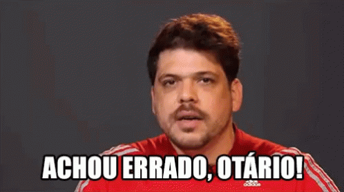

---
title:
author:
date: <h4>13 de Dezembro, 2018</h4>
output:
  revealjs::revealjs_presentation:
    css: custom_css.css
    theme: night
    widescreen: true
    transition: fade
    center: false
    self_contained: false
    backgroundTransition: fade
    reveal_plugins: ["notes"]
    slide_level: 1
    reveal_options:
      slideNumber: true
---

#

<h2>5 dicas para sobreviver à pós-graduação</h2>

<h3>(você não vai acreditar na número 4...)</h3>


<div align="right">
<p>Gustavo Burin **FERREIRA**</p>
<h6>arietebio@gmail.com</h6>
<h6>@gustavoburin</h6>
</div>

# Avisos {.center}

- Não é uma palestra de coaching ~~quântico~~
- Minha experiência é só minha
- Meus exemplos: ilustração
- Humor != falta de respeito
  
# {data-background="img/agradecimentos.png" data-background-size=70%}

# 


# {.center}


# {.center}


# {.subtitle}

<h1>Saúde Mental</h1>
<h2>Alguns Dados</h2>
  
# {.center}

> - Depressão: mal do século XXI
> - 6% da população
> - Berkeley: 43-46% de PG com depressão
> - Arizona: maioria de PG com "more than average" a "tremendous" níveis de stress
> - Dados de reports, pouca reprodutibilidade

#

## Levecque *et al.* 2017 Res. Policy

> - Flanders: 1 em cada 2 estudantes apresentaram angústias psicológicas
> - 1 em cada 3 estão em risco de doenças psiquiátricas comuns
> - Valores são mais altos que população com alta formação
> - Sintomas: estafa, infelicidade e depressão, falta de sono e inabilidade em superar dificuldades ou aproveitar o cotidiano


#

## Evans *et al.* 2018 Nat. Biotech {.center}

# {.center}


# {.center}


# {.center}


# Importância {.subtitle}

# {.center}

## Lisa McElroy (Drexel University - EUA)
- Transtorno de ansiedade
- Só se abriu após *tenure*
- Carreira assegurada: liberdade para falar sobre tema
- Exposição != cura

# {.center}

## Outros relatos

> - Robbie Hable (UKansas): luta contra sistema falho, não falhas pessoais
> - Vince Butita (UWisconsin): mensagens positivas sobre artigo
> - Mattias Björnmalm (Imp. College): recompensar produções/carreiras alternativas
> - Franziska Frank (Umea): reflexão sobre o que se realmente quer

  
# Minha trajetória {data-notes="Vou passar pelos mesmo pontos que o pinguim falou de maneira diferente. Na iniciação e no mestrado eu trabalhei com dendrocronologia. Ao fim do mestrado, percebi que continuar não era a melhor escolha. O que fazer então?" .subtitle}

  
# {data-notes="Sempre achei que queria ficar na academia, então fui testar o mercado de trabalho para ter certeza de que academia era o meu lugar mesmo. E era." data-background="img/dendro.png" data-background-size=50%}

# {.center}

> - Consultoria
> - Cosméticos: estratégia internacional
> - Análise de redes de co-autoria
> - Limitado/pragmático

# De volta à academia {data-notes="O primeiro ano foi um misto de empolgação e bastante tensão. Mais ambientado, potencial do meu trabalho + ansiedade prejudicava." .subtitle}

# {data-notes="Terceira vez fapesp negada. Também fui RD na CCP, possibilidade de ajudar aluno(a)s com dificuldades e plantar sementes como EcoEscola e Café existencial." data-background-video="img/math_class.mp4" data-background-video-loop=true}

# {data-background="img/self_five.gif" .center}

# {data-notes="No meio pro final do 2 ano, o artigo foi aceito." .center}


# 1º capítulo aceito {.subtitle}

# {data-background="img/yeah_no.gif" .center}


# 1º capítulo publicado {data-notes="Algo bizarro aconteceu. A fapesp entrou em contato e reconheceu o erro." data-background="img/natcomms.png" data-background-size=80%}



# Contato da FAPESP {data-notes="Mudanças: terapia + remédio. Fim de 2015 (metade do 3o ano) eu pesava 201kg, e resolvi que a melhor coisa a fazer seria a cirurgia bariátrica." .center}


#


# {data-background="img/cirurgia/montagem.png" width=80% .center}

<h1 class="fragment" style="background:rgba(0,0,0,0.85);"><font color="white">Fev/2016: 201kg</font></h1>


     
# {data-notes="Entrando no último ano resolvi fazer a cirurgia. Você é louco?! Foi a melhor decisão que tomei." data-background="img/psycotherapist.jpg" data-background-size=50%}

#


  
# {data-background="img/humble_brag.gif" data-notes="Como sou nerd e gosto de estatísticas, registrei dados sempre que possível e fiz um gráfico da mudança das minhas atividades e peso antes e depois da cirurgia."}
  
# {data-notes="Mesmo com a correria dos últimos meses, não me arrependo de ter feito a cirurgia. Minha disposição mudou, e tenho certeza que eu não renderia tão bem no último ano caso não tivesse feito." .center}

```{r echo = FALSE, warning = FALSE, fig.height = 7, fig.width = 7}
#library("strava")
#library("tidyverse")
strava.data <- read.csv("./data/strava_data/activities.csv")
strava.data$date <- as.Date(strava.data$date)
strava.data <- strava.data[-(1:3),]
fit.data <- read.csv("fit_summary.csv")
fit.data$Date <- as.Date(fit.data$Date, format = "%Y-%m-%d")

data.plot <- data.frame(date = c(as.Date(fit.data$Date), as.Date(strava.data$date)),
                        steps = c(fit.data$Step.count, rep(NA, nrow(strava.data))),
                        dist = c(rep(NA, nrow(fit.data)), strava.data$distance)
                        )

data.plot <- data.plot[order(data.plot$date),]

library("ggplot2")
library("cowplot")
library("reshape2")

ggplot(data = data.plot, aes(x = date)) +
    geom_line(aes(x = date, y = steps), colour = "darkgrey") +
    geom_line(data = subset(data.plot, !is.na(data.plot$dist)), aes(x = date, y = dist), colour = "red", size = 1.5, alpha = 0.5) +
    geom_vline(xintercept = as.Date("2016-06-09"), colour = "red", linetype = "dashed", alpha = 0.75) +
    scale_y_continuous(sec.axis = sec_axis(~./1000, name = "Distância (km)")) +
    labs(x = "Data", y = "Passos")

```


# Últimos 4 meses = 3º capítulo (um pouco mais de biologia) {data-notes="Depois desse momento 'Arquivo Confidencial', as mensagens que eu tentei passar com meu relato são:" .subtitle}


#

<div class="row">
  <div class="column">
  
  </div>
  <div class="column">
  <br></br>
  <br></br>
  <h3>Orientador: Tiago Bosisio **QUENTAL**</h3>
  <h3>Co-orientador: Paulo R. **GUIMARÃES** Jr</h3>
</div>

# {.center}
<h2>Resultados da Tese</h2>

> - Cap1: Onívoros parecem ser um ralo macroevolutivo (Nat. Comms.)
> - Cap2: Métodos filogenéticos estimam bem no presente + reconstrução errada (Syst. Biol.)
> - Cap3: Espécies de linhagens menos estáveis não são centrais em regiões temperadas (*in prep.*)

# Mensagens das minhas experiências {.subtitle}
 
# {.center}

> - Não tenha medo de mudar. O novo assusta, mas também empolga.
> - Os problemas vão surgir (ansiedade, depressão, estresse), estejam preparados para lidar com eles.
> - Não deixe as adversidades te paralisarem, e não tenha medo de tentar coisas diferentes do recomendado.
> - Sua saúde (física e mental) e sua vida fora da academia importam tanto quanto seu esforço no laboratório.

# Minhas dicas? {.subtitle}

---

## 1 - Conversa aberta com orientador(a)


---

## 2 - Work-life balance


   
---

## 3 - Coletivos


---

## 4 - NADA {.center}


---
   
## 5 - Hobbies

<div class="row">
  <div class="column">
  
  </div>
  <div class="column">
  
</div>


# {.center}


> “But I am very poorly today and very stupid and hate everybody and everything.”

# {.center}

> "...On my second or third night there, I was standing at the back of the hall, while a musical entertainment happened, and I started talking to a very nice, polite, elderly gentleman about several things, including our shared first name. And then he pointed to the hall of people, and said words to the effect of, 'I just look at all these people, and I think, what the heck am I doing here? They’ve made amazing things. I just went where I was sent.'

# {.center}

> "And I said, 'Yes. But you were the first man on the moon. I think that counts for something.' And I felt a bit better. Because if Neil Armstrong felt like an impostor, maybe everyone did... Maybe there weren’t any grown-ups, only people who had worked hard and also got lucky and were slightly out of their depth, all of us doing the best job we could, which is all we can really hope for."

> - Neil Gaiman

  
# A pós-graduação é mais que seu projeto (e sua tese)! {data-notes="Ao mesmo tempo, tentar aproveitar e criar um ambiente bom de trabalho, com uma equipe legal." .subtitle}

# {data-background="img/labmeme.png" data-background-size=100% .center}

<h1 class="fragment" style="background:rgba(0,0,0,0.85);"><font color="white">Balanço entre se levar a sério e não se levar muito a sério ;-)</font></h1>

# Obrigado! {.subtitle}

### arietebio @ gmail.com

### @gustavoburin

### https://www.gburin.com
### https://blog.gburin.com