
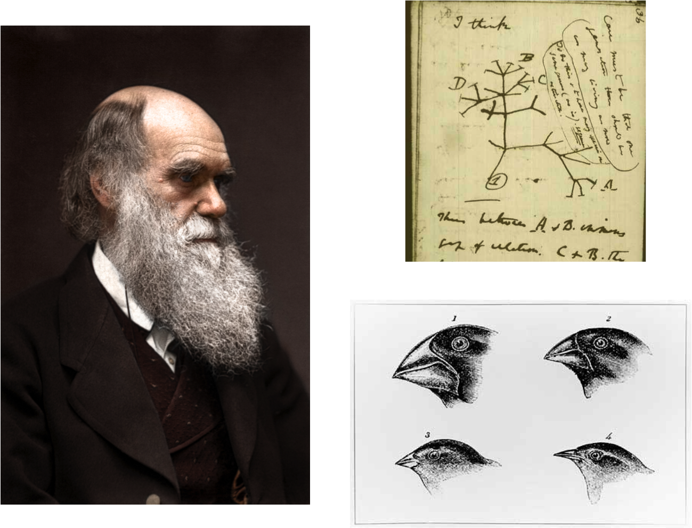

--- &vcenter

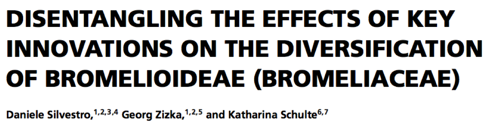

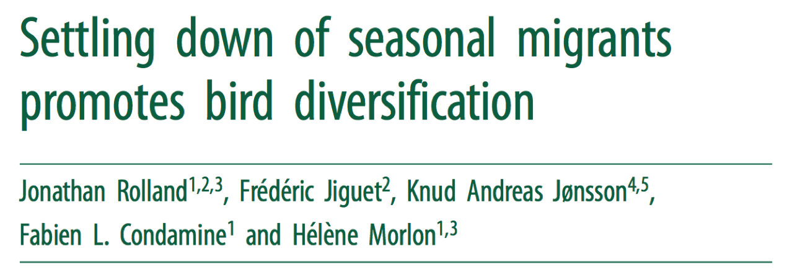

---

## Trait-dependent diversification

--- &twocol

## Birds

*** {name: left}

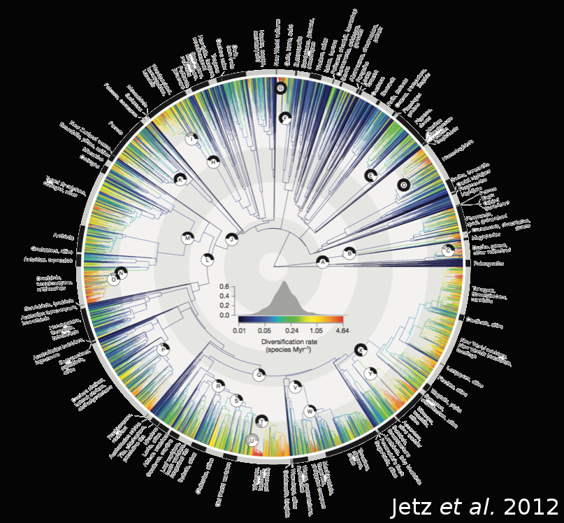

*** {name: right}

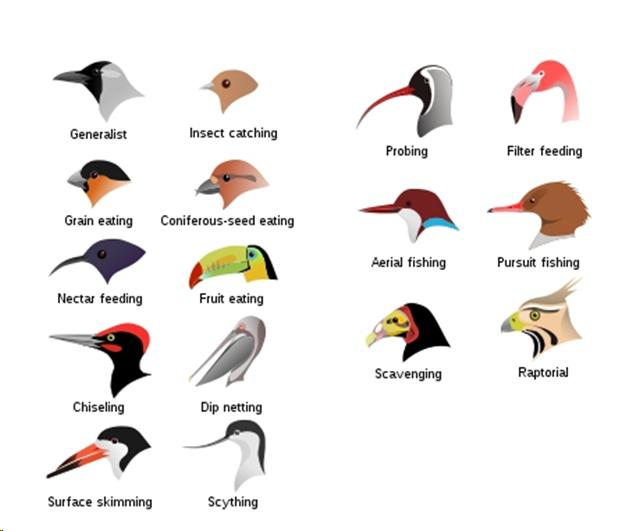

--- &section

## Is there any relationship between diet and diversification rates in birds?

--- &section

## Data - Phylogeny

--- 

--- &section

## Methods - Diversification model

---

## Trait-dependent diversification

### MuSSE - Multiple-State Speciation and Extinction </h3>

> - Bayesian implementation
> - (https://github.com/dsilvestro/mcmc-diversitree/)

---

## Analysis

> - Comprehensive dietary database (Sekercioglu *et al.* 2004, updated with del
  Hoyo *et al.*, 2013)
> - 9 states: *Carnivores, Frugivores, Granivores, Herbivores,
Insectivores, Nectarivores, Omnivores, Piscivores, Scavengers*
> - 200 trees (100 from each backbone)
> - Total of **93** parameters

---

--- &section

## Results - Diversification rates

---

### Net Diversification rates

---

## Speciation/Extinction rates

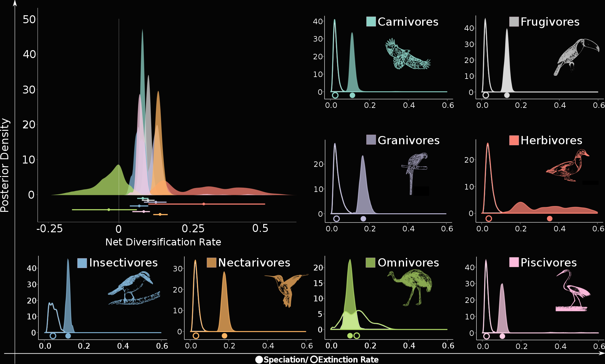

---

## Speciation/Extinction rates

---

### Rate differences

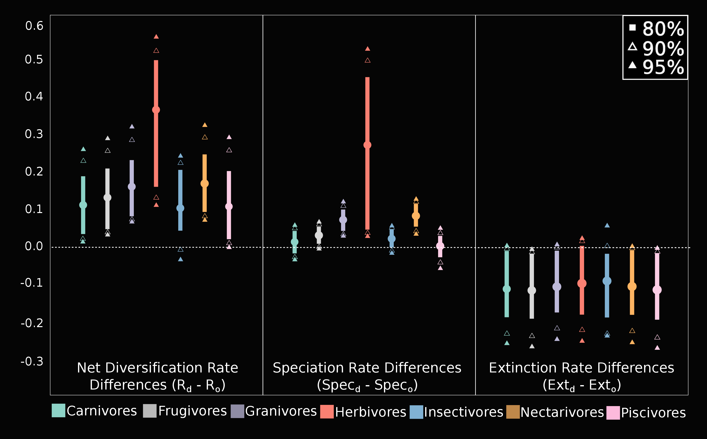

---

### Rate differences

---

## Transition rates

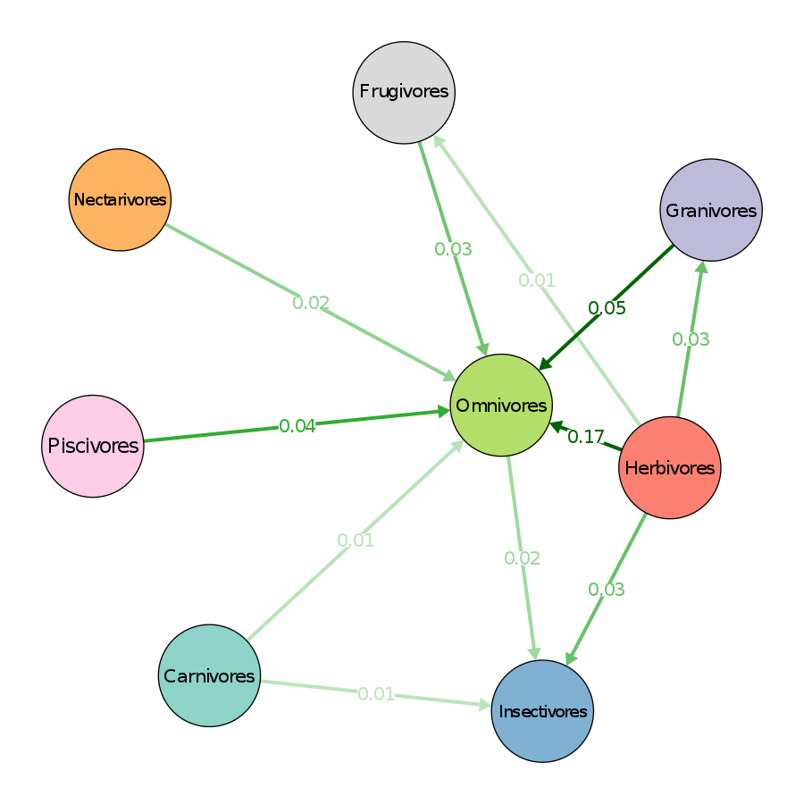

--- &section

## Ecological scenario for macroevolutionary patterns

---

## Omnivore niche

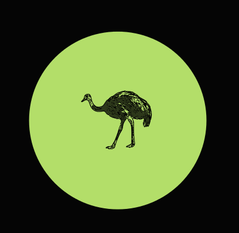

---

## Non-omnivore niche

---

## Inter-guild competition

--- &section

## Times of stable and/or predictable resources

--- &twocol

### Times of stable and/or predictable resources

*** =left

*** =right

--- &twocol

### Times of stable and/or predictable resources

*** =left

*** =right

---

--- &section

## Times of unstable and/or unpredictable resources

---

### Times of unstable and/or unpredictable resources

--- &twocol

### Times of unstable and/or unpredictable resources

*** =left

*** =right

---

---

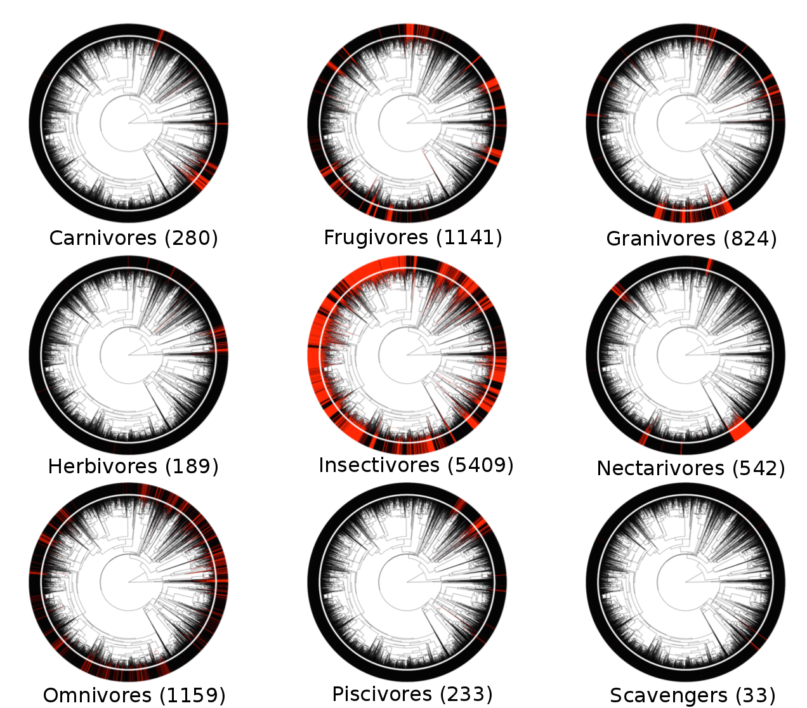

---

---

## Take home messages

> - Omnivores: lower net diversification
> - Higher extinction
> - Lower speciation
> - High transition into omnivores

---

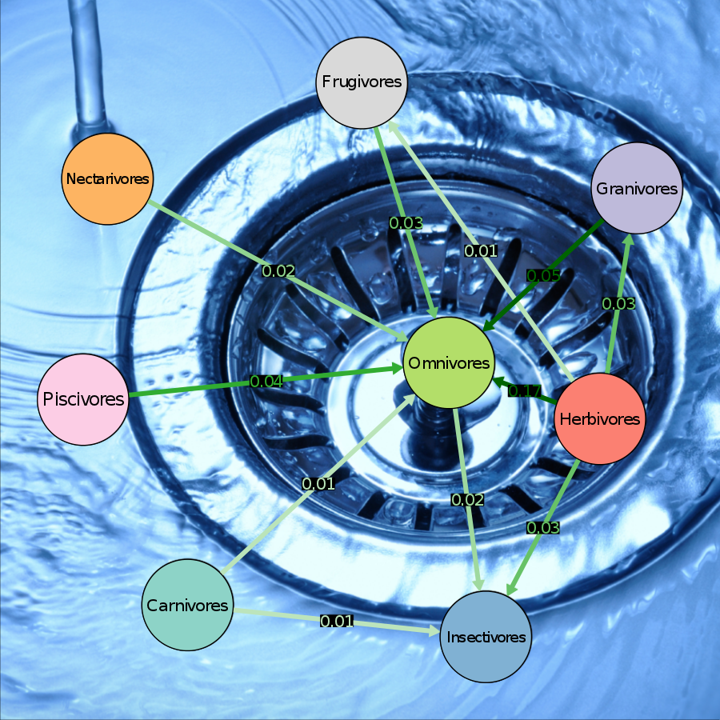

--- &vcenter

## Acknowledgements

--- &twocol

## Acknowledgements

*** =left

*** =right

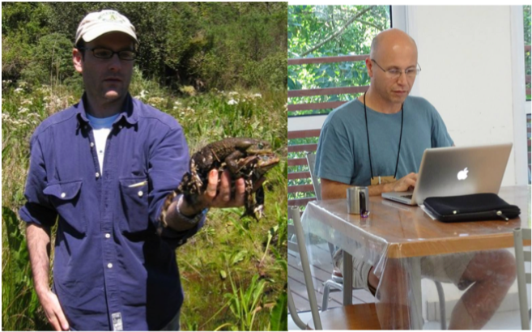

---

## Acknowledgements

--- &section

## Thank you very much!

